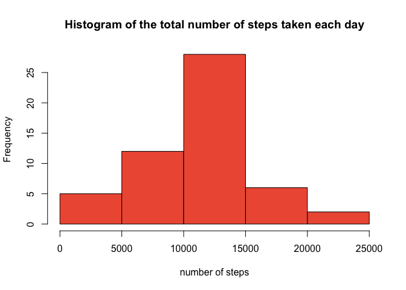
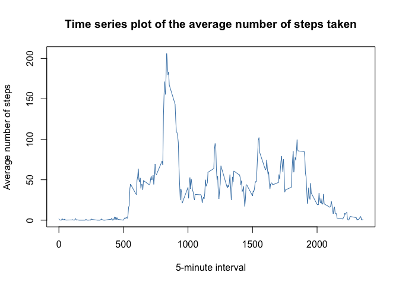
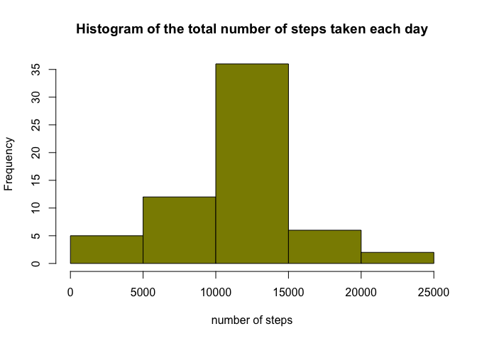
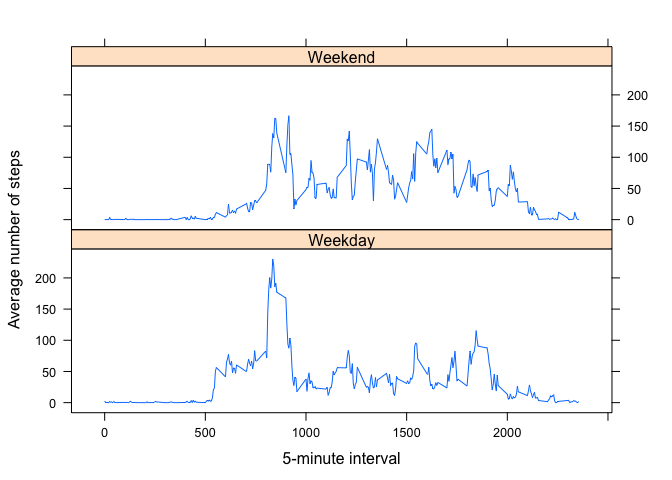

## Loading and preprocessing the data

```r
data <- read.csv("activity.csv", header = TRUE)
x <- as.Date(data$date, format= "%Y-%m-%d")
head(data)
```

```
##   steps       date interval
## 1    NA 2012-10-01        0
## 2    NA 2012-10-01        5
## 3    NA 2012-10-01       10
## 4    NA 2012-10-01       15
## 5    NA 2012-10-01       20
## 6    NA 2012-10-01       25
```

## What is mean total number of steps taken per day?

#### Calculating the total number of steps taken per day (spd)

```r
spd <- aggregate(data$steps, by = list(data$date), FUN = sum)
names(spd) <- c("date", "steps")
head(spd)
```

```
##         date steps
## 1 2012-10-01    NA
## 2 2012-10-02   126
## 3 2012-10-03 11352
## 4 2012-10-04 12116
## 5 2012-10-05 13294
## 6 2012-10-06 15420
```
#### Making a histogram of the total number of steps taken per day

```r
hist(spd$steps, xlab = "number of steps", main = "Histogram of the total number of steps taken each day", col = "tomato2")
```

<!-- -->

#### Calculating the mean and median of the total number of steps taken each day

```r
mean(spd$steps, na.rm = TRUE)
```

```
## [1] 10766.19
```

```r
median(spd$steps, na.rm = TRUE)
```

```
## [1] 10765
```

## What is the average daily activity pattern?

```r
aspi <- aggregate(data$steps, by = list(data$interval), FUN = mean, na.rm = TRUE, na.action = na.omit)
names(aspi) <- c("interval", "mean")
plot(aspi$interval, aspi$mean, type = "l", pch = 19, col = "steelblue", 
     xlab = "5-minute interval", 
     ylab = "Average number of steps",
     main = "Time series plot of the average number of steps taken")
```

<!-- -->

#### The 5-minute interval that, on average,contains the maximum number of steps

```r
aspi[which.max(aspi$mean),]
```

```
##     interval     mean
## 104      835 206.1698
```

## Imputing missing values
#### Calculating the total number of missing values in the dataset

```r
sum(!complete.cases(data))
```

```
## [1] 2304
```

#### Filling in all of the missing values in the dataset with the mean for that 5-minute interval (data2)

```r
data2 <- data
for (i in 1 : length(data2$steps)) {
      if (is.na(data2$steps[i]) == TRUE) {
        data2$steps[i] <- aspi$mean[which(aspi$interval == data2$interval[i])]
      }
}
head(data)
```

```
##   steps       date interval
## 1    NA 2012-10-01        0
## 2    NA 2012-10-01        5
## 3    NA 2012-10-01       10
## 4    NA 2012-10-01       15
## 5    NA 2012-10-01       20
## 6    NA 2012-10-01       25
```

#### Making a histogram of the total number of steps taken each day after missing values are imputed

```r
spd2 <- aggregate(data2$steps, by = list(data2$date), FUN = sum)
names(spd2) <- c("date", "steps")
hist(spd2$steps, xlab = "number of steps", main = "Histogram of the total number of steps taken each day", col = "yellow4")
```

<!-- -->

#### Calculating the mean and median of the total number of steps taken each day after missing values are imputed

```r
mean(spd2$steps, na.rm = TRUE)
```

```
## [1] 10766.19
```

```r
median(spd2$steps, na.rm = TRUE)
```

```
## [1] 10766.19
```

## Are there differences in activity patterns between weekdays and weekends?
#### Creating a new factor variable with two levels- "weekday" and "weekend"

```r
data2$day <- weekdays(as.Date(data2$date))
for (i in 1 : length(data2$day)) {
      if (data2$day[i] == "Saturday" || data2$day[i] == "Sunday") {
            data2$day[i] <- "Weekend"
      } else {
           data2$day[i] <- "Weekday"
      }
}
```
#### Calculating average number of steps per interval across all weekdays and weekends

```r
library(plyr)
aspi2 <- ddply(data2, .(interval, day), summarize, mean = round(mean(steps), 2))
head(aspi2)
```

```
##   interval     day mean
## 1        0 Weekday 2.25
## 2        0 Weekend 0.21
## 3        5 Weekday 0.45
## 4        5 Weekend 0.04
## 5       10 Weekday 0.17
## 6       10 Weekend 0.02
```
#### Making a panel plot of the 5-minute interval and the average number of steps taken for weekdays and weekends

```r
library(lattice)
xyplot(mean ~ interval | day, 
       data = aspi2,
       type = "l",
       xlab = "5-minute interval",
       ylab = "Average number of steps",
       layout = c(1,2))
```

<!-- -->
